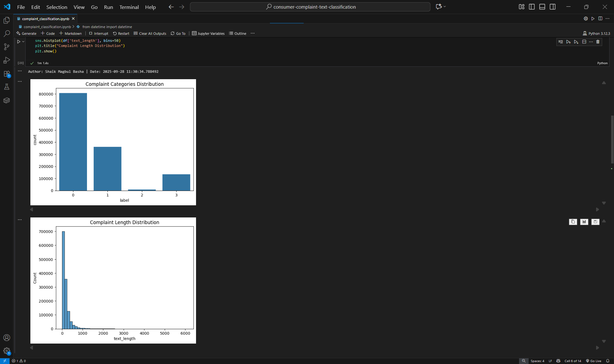
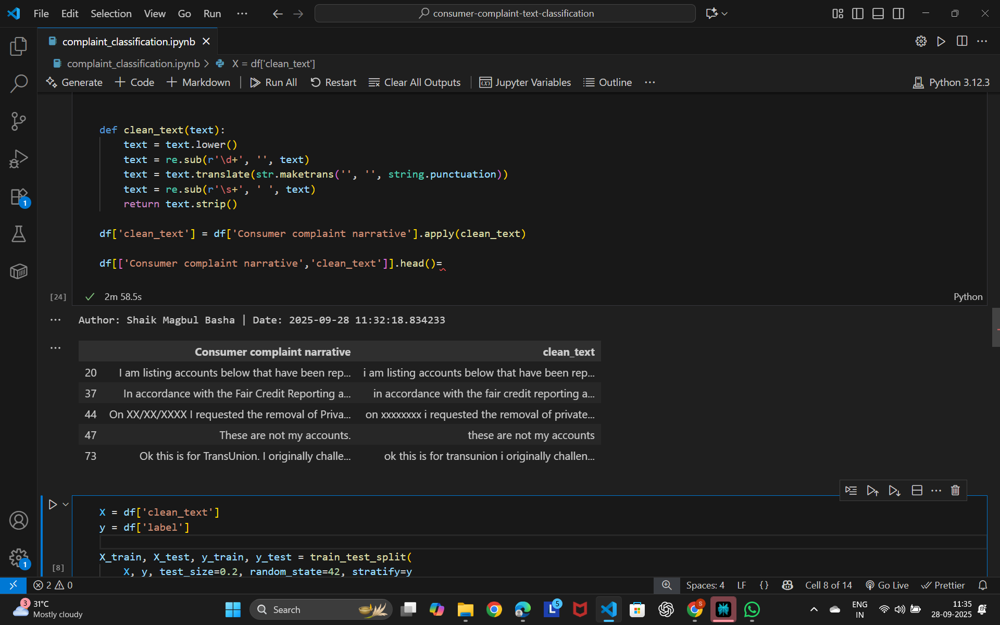
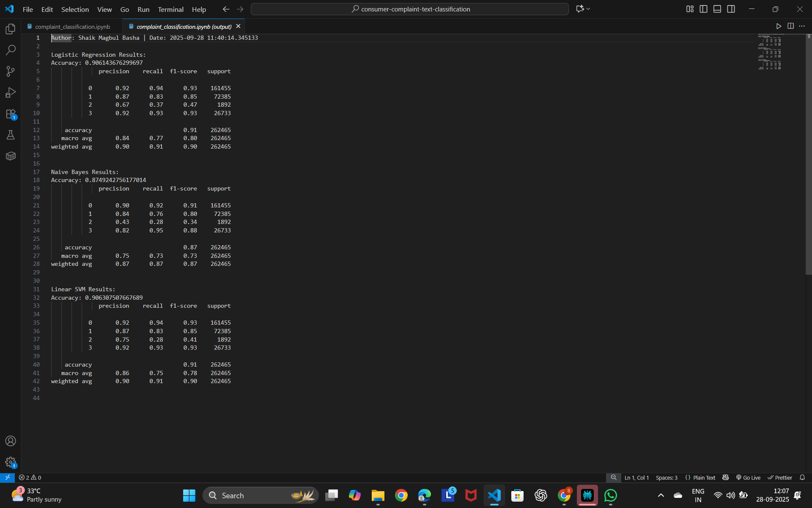
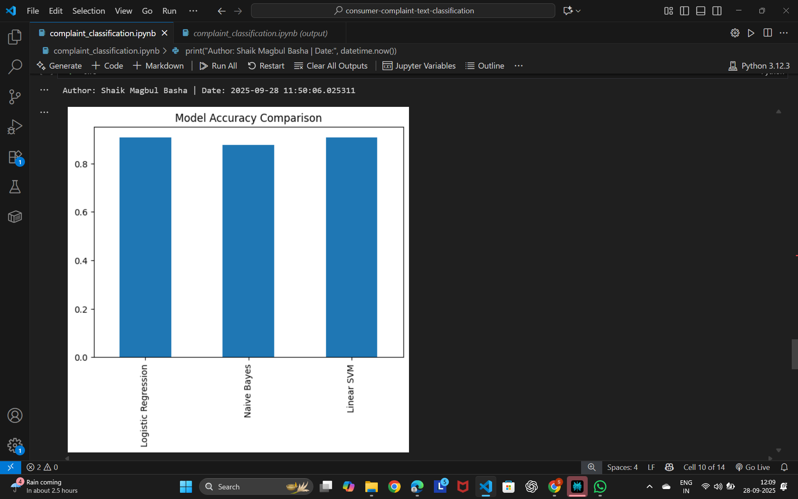
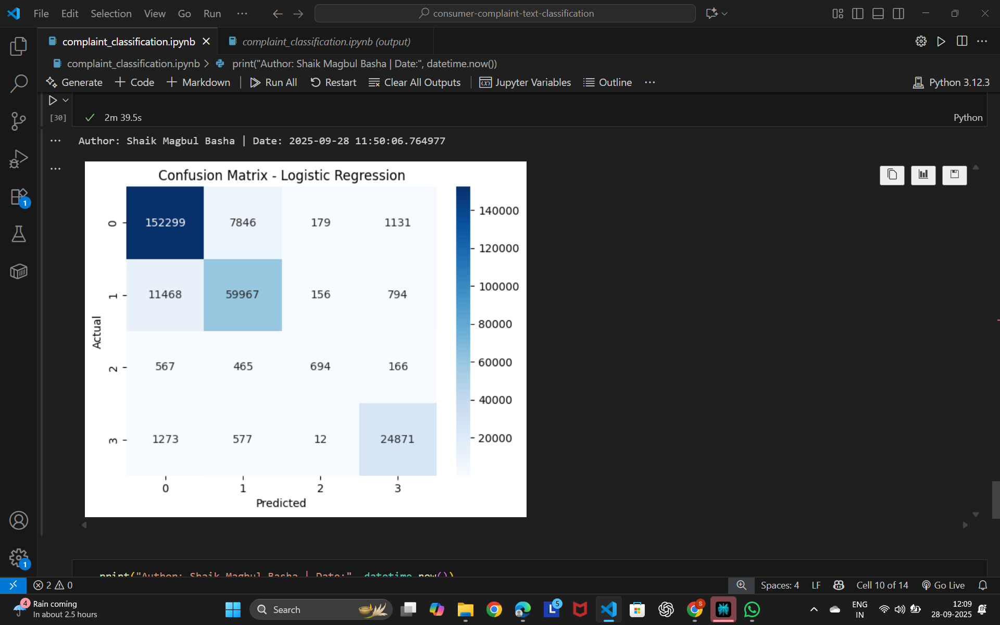

# Task 5: Text Classification on Consumer Complaint Dataset

**Author:** Shaik Magbul Basha  
**Date:** 2025-09-28  

This project performs text classification on the [Consumer Complaint Database](https://catalog.data.gov/dataset/consumer-complaint-database) into the following categories:

- 0: Credit reporting, repair, or other  
- 1: Debt collection  
- 2: Consumer Loan  
- 3: Mortgage  

The following steps have been implemented:

---

## Step 1: Explanatory Data Analysis (EDA)
- Overview of dataset
- Complaint category distribution
- Complaint length distribution

  

---

## Step 2: Text Pre-processing
- Text cleaning: lowercase, remove numbers, punctuation, extra spaces
- Display of cleaned text

  

---

## Step 3: Model Selection
- Multi-class classification models selected
- Model hyperparameters and setup

  

---

## Step 4: Model Performance Comparison
- Comparison of models using metrics like accuracy, F1-score
- Visualization of model performance

  

---

## Step 5: Model Evaluation
- Confusion matrix of best model
- Classification report with precision, recall, F1-score

  

---

## Step 6: Prediction
- Sample predictions on test data
- Final predictions output

  

---

